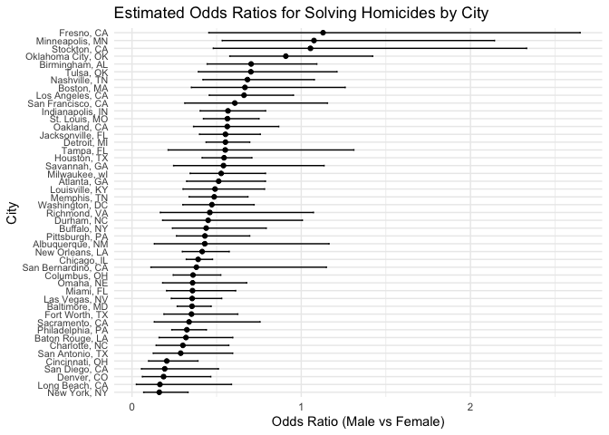

Homework 6
================
Samina Rashiq
2024-12-02

### Problem 1

``` r
weather_df = 
  rnoaa::meteo_pull_monitors(
    c("USW00094728"),
    var = c("PRCP", "TMIN", "TMAX"), 
    date_min = "2017-01-01",
    date_max = "2017-12-31") %>%
  mutate(
    name = recode(id, USW00094728 = "CentralPark_NY"),
    tmin = tmin / 10,
    tmax = tmax / 10) %>%
  select(name, id, everything())
```

    ## using cached file: /Users/saminarashiq/Library/Caches/org.R-project.R/R/rnoaa/noaa_ghcnd/USW00094728.dly

    ## date created (size, mb): 2024-12-01 00:10:44.790019 (8.667)

    ## file min/max dates: 1869-01-01 / 2024-11-30

### Problem 2

``` r
# Import, clean, and filter data
homicide_data <- 
  read_csv("data/homicide-data.csv") %>%
  mutate(
    city_state = paste(city, state, sep = ", "),
    solved = if_else(disposition == "Open/No arrest", 0, 1),
    victim_age = na_if(victim_age, "Unknown"),
    victim_age = as.numeric(victim_age)
  ) %>%
  filter(
    !is.na(victim_age),
    !(city_state %in% c("Dallas, TX", "Phoenix, AZ", "Kansas City, MO", "Tulsa, AL")),
    victim_race %in% c("White", "Black"),
    victim_sex != "Unknown"
  )
```

    ## Rows: 52179 Columns: 12
    ## ── Column specification ────────────────────────────────────────────────────────
    ## Delimiter: ","
    ## chr (9): uid, victim_last, victim_first, victim_race, victim_age, victim_sex...
    ## dbl (3): reported_date, lat, lon
    ## 
    ## ℹ Use `spec()` to retrieve the full column specification for this data.
    ## ℹ Specify the column types or set `show_col_types = FALSE` to quiet this message.

##### Logistic regression for Baltimore, MD

``` r
# Filter dataset for Baltimore, MD
baltimore_data <- 
  homicide_data %>%
  filter(city_state == "Baltimore, MD")

# Fit logistic regression controlling for victim_age and victim_race
baltimore_lm <- 
  baltimore_data %>%
  glm(solved ~ victim_sex + victim_age + victim_race, 
      data = ., 
      family = binomial())

# Extract the OR and 95% CI for Males vs. Females (ref group)
male_female_odds <- baltimore_lm %>%
  broom::tidy(conf.int = TRUE) %>%
  mutate(
    OR = exp(estimate),
    OR_low = exp(conf.low),
    OR_high = exp(conf.high)
  ) %>%
  filter(term == "victim_sexMale")

# Print the result
male_female_odds %>%
  select(
    Term = term,             
    Log_Odds = estimate,
    Odds_Ratio = OR,
    CI_Lower = OR_low,
    CI_Upper = OR_high,
    P_Value = p.value
  ) %>%
  knitr::kable(
    digits = 3,              
    format = "markdown"
  )
```

| Term           | Log_Odds | Odds_Ratio | CI_Lower | CI_Upper | P_Value |
|:---------------|---------:|-----------:|---------:|---------:|--------:|
| victim_sexMale |   -1.037 |      0.355 |    0.267 |    0.468 |       0 |

The odds of homicide for males is 64.5% lower than the odds for females,
holding age and race constant.

##### Linear model for

``` r
# Run logistic regression for each city and extract ORs and CIs
cityresults_bysex <- homicide_data %>%
  group_by(city_state) %>%
  nest() %>% 
  mutate(
    city_sex_model = map(data, ~ glm(solved ~ victim_sex + victim_age + victim_race, 
                            family = binomial, data = .x)),
    tidy_city_sex_model = map(city_sex_model, ~ tidy(.x, conf.int = TRUE)),
    odds_ratios = map(tidy_city_sex_model, ~ filter(.x, term == "victim_sexMale") %>%
                        mutate(odds_ratio = exp(estimate),
                               conf.low = exp(conf.low),
                               conf.high = exp(conf.high)))
  ) %>%
  unnest(odds_ratios, keep_empty = TRUE) %>% 
  select(city_state, odds_ratio, conf.low, conf.high, estimate, std.error, p.value)


# Print the results
cityresults_bysex %>%
  select(
    City = city_state,
    Odds_Ratio = odds_ratio,
    CI_Lower = conf.low,
    CI_Upper = conf.high,
    Log_Odds = estimate,
    Std_Error = std.error,
    P_Value = p.value
  ) %>%
  slice(1:12) %>%
  knitr::kable(
    digits = 3,
    format = "markdown",
    caption = "OR for Solving Homicides by Sex (Male vs. Female) [12obs]")
```

| City               | Odds_Ratio | CI_Lower | CI_Upper | Log_Odds | Std_Error | P_Value |
|:-------------------|-----------:|---------:|---------:|---------:|----------:|--------:|
| Albuquerque, NM    |      0.430 |    0.132 |    1.164 |   -0.844 |     0.546 |   0.122 |
| Atlanta, GA        |      0.512 |    0.323 |    0.789 |   -0.669 |     0.227 |   0.003 |
| Baltimore, MD      |      0.355 |    0.267 |    0.468 |   -1.037 |     0.143 |   0.000 |
| Baton Rouge, LA    |      0.319 |    0.160 |    0.596 |   -1.143 |     0.333 |   0.001 |
| Birmingham, AL     |      0.704 |    0.444 |    1.092 |   -0.351 |     0.229 |   0.125 |
| Boston, MA         |      0.667 |    0.351 |    1.260 |   -0.404 |     0.324 |   0.212 |
| Buffalo, NY        |      0.438 |    0.239 |    0.793 |   -0.825 |     0.305 |   0.007 |
| Charlotte, NC      |      0.301 |    0.143 |    0.572 |   -1.201 |     0.351 |   0.001 |
| Chicago, IL        |      0.391 |    0.321 |    0.476 |   -0.939 |     0.101 |   0.000 |
| Cincinnati, OH     |      0.206 |    0.098 |    0.390 |   -1.582 |     0.350 |   0.000 |
| Columbus, OH       |      0.361 |    0.243 |    0.525 |   -1.020 |     0.195 |   0.000 |
| Denver, CO         |      0.187 |    0.061 |    0.466 |   -1.679 |     0.507 |   0.001 |
| Detroit, MI        |      0.552 |    0.438 |    0.696 |   -0.594 |     0.118 |   0.000 |
| Durham, NC         |      0.450 |    0.181 |    1.007 |   -0.798 |     0.433 |   0.065 |
| Fort Worth, TX     |      0.351 |    0.189 |    0.625 |   -1.046 |     0.304 |   0.001 |
| Fresno, CA         |      1.129 |    0.454 |    2.648 |    0.121 |     0.445 |   0.785 |
| Houston, TX        |      0.544 |    0.414 |    0.709 |   -0.609 |     0.137 |   0.000 |
| Indianapolis, IN   |      0.567 |    0.403 |    0.790 |   -0.567 |     0.172 |   0.001 |
| Jacksonville, FL   |      0.552 |    0.399 |    0.758 |   -0.593 |     0.164 |   0.000 |
| Las Vegas, NV      |      0.356 |    0.232 |    0.530 |   -1.034 |     0.210 |   0.000 |
| Long Beach, CA     |      0.165 |    0.026 |    0.588 |   -1.802 |     0.757 |   0.017 |
| Los Angeles, CA    |      0.662 |    0.457 |    0.954 |   -0.413 |     0.188 |   0.028 |
| Louisville, KY     |      0.491 |    0.301 |    0.784 |   -0.712 |     0.243 |   0.003 |
| Memphis, TN        |      0.486 |    0.337 |    0.685 |   -0.722 |     0.180 |   0.000 |
| Miami, FL          |      0.358 |    0.204 |    0.613 |   -1.029 |     0.279 |   0.000 |
| Milwaukee, wI      |      0.527 |    0.343 |    0.789 |   -0.641 |     0.212 |   0.002 |
| Minneapolis, MN    |      1.075 |    0.533 |    2.142 |    0.073 |     0.353 |   0.837 |
| Nashville, TN      |      0.682 |    0.419 |    1.078 |   -0.382 |     0.240 |   0.111 |
| New Orleans, LA    |      0.415 |    0.297 |    0.575 |   -0.880 |     0.168 |   0.000 |
| New York, NY       |      0.161 |    0.069 |    0.331 |   -1.824 |     0.395 |   0.000 |
| Oakland, CA        |      0.563 |    0.364 |    0.867 |   -0.574 |     0.221 |   0.009 |
| Oklahoma City, OK  |      0.909 |    0.578 |    1.423 |   -0.096 |     0.229 |   0.677 |
| Omaha, NE          |      0.358 |    0.181 |    0.678 |   -1.027 |     0.335 |   0.002 |
| Philadelphia, PA   |      0.324 |    0.235 |    0.440 |   -1.127 |     0.159 |   0.000 |
| Pittsburgh, PA     |      0.431 |    0.263 |    0.696 |   -0.842 |     0.248 |   0.001 |
| Richmond, VA       |      0.460 |    0.167 |    1.072 |   -0.777 |     0.466 |   0.096 |
| Sacramento, CA     |      0.337 |    0.132 |    0.757 |   -1.087 |     0.440 |   0.013 |
| San Antonio, TX    |      0.288 |    0.126 |    0.595 |   -1.246 |     0.393 |   0.002 |
| San Bernardino, CA |      0.380 |    0.112 |    1.149 |   -0.966 |     0.582 |   0.097 |
| San Diego, CA      |      0.194 |    0.056 |    0.511 |   -1.642 |     0.550 |   0.003 |
| San Francisco, CA  |      0.608 |    0.312 |    1.155 |   -0.498 |     0.332 |   0.134 |
| Savannah, GA       |      0.540 |    0.246 |    1.135 |   -0.615 |     0.387 |   0.112 |
| St. Louis, MO      |      0.564 |    0.422 |    0.751 |   -0.573 |     0.147 |   0.000 |
| Stockton, CA       |      1.055 |    0.480 |    2.332 |    0.053 |     0.400 |   0.894 |
| Tampa, FL          |      0.551 |    0.214 |    1.311 |   -0.596 |     0.457 |   0.193 |
| Tulsa, OK          |      0.703 |    0.392 |    1.211 |   -0.353 |     0.286 |   0.218 |
| Washington, DC     |      0.472 |    0.300 |    0.722 |   -0.751 |     0.223 |   0.001 |

OR for Solving Homicides by Sex (Male vs. Female) \[12obs\]

``` r
cityresults_bysex_ordered <- cityresults_bysex %>%
  arrange(odds_ratio)  # Arrange data by odds_ratio in ascending order

# Plot the data
ggplot(cityresults_bysex_ordered, aes(x = reorder(city_state, odds_ratio), y = odds_ratio)) +
  geom_point() +
  geom_errorbar(aes(ymin = conf.low, ymax = conf.high), width = 0.2) +
  coord_flip() +
  labs(
    title = "Estimated Odds Ratios for Solving Homicides by City",
    x = "City",
    y = "Odds Ratio (Male vs Female)"
  ) +
  theme_minimal() +
  theme(
    axis.text.y = element_text(size = 8)
  )
```

<!-- -->
