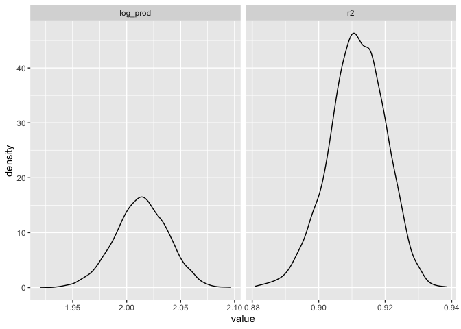
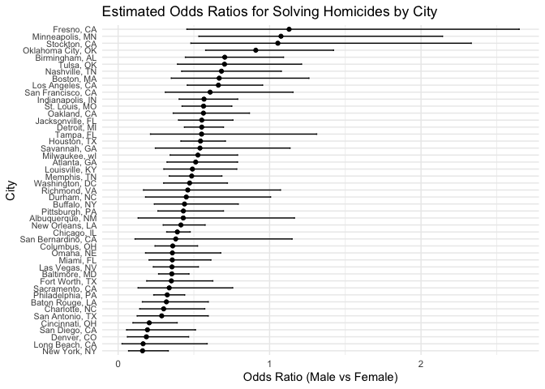
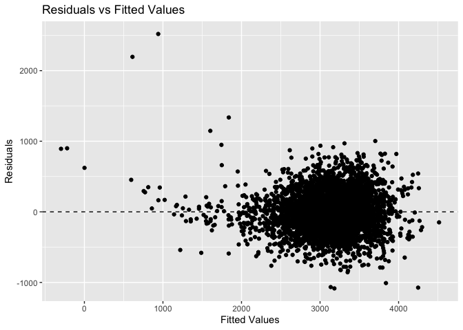
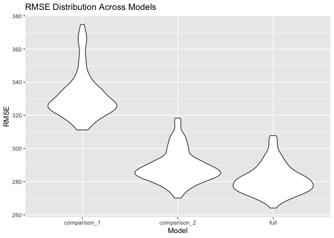

Homework 6
================
Samina Rashiq
2024-12-02

### Problem 1

``` r
# Import data
weather_df = 
  rnoaa::meteo_pull_monitors(
    c("USW00094728"),
    var = c("PRCP", "TMIN", "TMAX"), 
    date_min = "2017-01-01",
    date_max = "2017-12-31") %>%
  mutate(
    name = recode(id, USW00094728 = "CentralPark_NY"),
    tmin = tmin / 10,
    tmax = tmax / 10) %>%
  select(name, id, everything())
```

    ## using cached file: /Users/saminarashiq/Library/Caches/org.R-project.R/R/rnoaa/noaa_ghcnd/USW00094728.dly

    ## date created (size, mb): 2024-12-01 00:10:44.790019 (8.667)

    ## file min/max dates: 1869-01-01 / 2024-11-30

``` r
# Produce estimates from each boostrap sample
set.seed(780)

bootstrap_results = 
  weather_df %>%
  modelr::bootstrap(n = 5000) %>%
  mutate(
    models = map(strap, \(df) lm(tmax ~ tmin, data = df)),
    r2 = map_dbl(models, \(model) glance(model)$r.squared),
    results = map(models, broom::tidy)) %>%
  unnest(results) %>%
  select(.id, term, estimate, r2) %>%
  pivot_wider(
    names_from = term,
    values_from = estimate
  ) %>%
  mutate(
    log_prod = log(`(Intercept)` * tmin)
  ) %>%
  select(r2, log_prod)

# View estimates
bootstrap_results %>%
  pivot_longer(
    everything(),
    names_to = "statistic", 
    values_to = "value"
  ) %>%
  ggplot(aes(x = value)) +
  geom_density() +
  facet_grid(~statistic, scales = "free")
```

<!-- -->

``` r
# Create 95% CIs 
bootstrap_results %>%
  summarise(
    R2_lower = quantile(r2, 0.025),
    R2_upper = quantile(r2, 0.975),
    logprod_lower = quantile(log_prod, 0.025),
    logprod_upper = quantile(log_prod, 0.975)
  ) %>%
  knitr::kable(
    col.names = c("R² 2.5%", "R² 97.5%", "log(β₀*β₁) 2.5%", "log(β₀*β₁) 97.5%"),
    digits = 3
  )
```

| R² 2.5% | R² 97.5% | log(β₀\*β₁) 2.5% | log(β₀\*β₁) 97.5% |
|--------:|---------:|-----------------:|------------------:|
|   0.894 |    0.927 |            1.964 |              2.06 |

### Problem 2

``` r
# Import, clean, and filter data
homicide_data <- 
  read_csv("data/homicide-data.csv") %>%
  mutate(
    city_state = paste(city, state, sep = ", "),
    solved = if_else(disposition == "Open/No arrest", 0, 1),
    victim_age = na_if(victim_age, "Unknown"),
    victim_age = as.numeric(victim_age)
  ) %>%
  filter(
    !is.na(victim_age),
    !(city_state %in% c("Dallas, TX", "Phoenix, AZ", "Kansas City, MO", "Tulsa, AL")),
    victim_race %in% c("White", "Black"),
    victim_sex != "Unknown"
  )
```

    ## Rows: 52179 Columns: 12
    ## ── Column specification ────────────────────────────────────────────────────────
    ## Delimiter: ","
    ## chr (9): uid, victim_last, victim_first, victim_race, victim_age, victim_sex...
    ## dbl (3): reported_date, lat, lon
    ## 
    ## ℹ Use `spec()` to retrieve the full column specification for this data.
    ## ℹ Specify the column types or set `show_col_types = FALSE` to quiet this message.

##### Logistic regression for Baltimore, MD

``` r
# Filter dataset for Baltimore, MD
baltimore_data <- 
  homicide_data %>%
  filter(city_state == "Baltimore, MD")

# Fit logistic regression controlling for victim_age and victim_race
baltimore_lm <- 
  baltimore_data %>%
  glm(solved ~ victim_sex + victim_age + victim_race, 
      data = ., 
      family = binomial())

# Extract the OR and 95% CI for Males vs. Females (ref group)
male_female_odds <- baltimore_lm %>%
  broom::tidy(conf.int = TRUE) %>%
  mutate(
    OR = exp(estimate),
    OR_low = exp(conf.low),
    OR_high = exp(conf.high)
  ) %>%
  filter(term == "victim_sexMale")

# Print the result
male_female_odds %>%
  select(
    Term = term,             
    Log_Odds = estimate,
    Odds_Ratio = OR,
    CI_Lower = OR_low,
    CI_Upper = OR_high,
    P_Value = p.value
  ) %>%
  knitr::kable(
    digits = 3,              
    format = "markdown"
  )
```

| Term           | Log_Odds | Odds_Ratio | CI_Lower | CI_Upper | P_Value |
|:---------------|---------:|-----------:|---------:|---------:|--------:|
| victim_sexMale |   -1.037 |      0.355 |    0.267 |    0.468 |       0 |

The odds having a homicide case solved for male victims is 64.5% lower
than the odds for female victims, holding age and race constant.

##### Linear model for all cities

``` r
# Run logistic regression for each city and extract ORs and CIs
cityresults_bysex <- homicide_data %>%
  group_by(city_state) %>%
  nest() %>% 
  mutate(
    city_sex_model = map(data, ~ glm(solved ~ victim_sex + victim_age + victim_race, 
                            family = binomial, data = .x)),
    tidy_city_sex_model = map(city_sex_model, ~ tidy(.x, conf.int = TRUE)),
    odds_ratios = map(tidy_city_sex_model, ~ filter(.x, term == "victim_sexMale") %>%
                        mutate(odds_ratio = exp(estimate),
                               conf.low = exp(conf.low),
                               conf.high = exp(conf.high)))
  ) %>%
  unnest(odds_ratios, keep_empty = TRUE) %>% 
  select(city_state, odds_ratio, conf.low, conf.high, estimate, std.error, p.value)


# Print the results
cityresults_bysex %>%
  ungroup() %>%                  
  select(
    City = city_state,
    Odds_Ratio = odds_ratio,
    CI_Lower = conf.low,
    CI_Upper = conf.high,
    Log_Odds = estimate,
    Std_Error = std.error,
    P_Value = p.value
  ) %>%
  slice(1:12) %>%
  knitr::kable(
    digits = 3,
    format = "markdown",
    caption = "ORs for Solving Homicides by Victim Sex (First 12 Obs)"
  )
```

| City            | Odds_Ratio | CI_Lower | CI_Upper | Log_Odds | Std_Error | P_Value |
|:----------------|-----------:|---------:|---------:|---------:|----------:|--------:|
| Albuquerque, NM |      0.430 |    0.132 |    1.164 |   -0.844 |     0.546 |   0.122 |
| Atlanta, GA     |      0.512 |    0.323 |    0.789 |   -0.669 |     0.227 |   0.003 |
| Baltimore, MD   |      0.355 |    0.267 |    0.468 |   -1.037 |     0.143 |   0.000 |
| Baton Rouge, LA |      0.319 |    0.160 |    0.596 |   -1.143 |     0.333 |   0.001 |
| Birmingham, AL  |      0.704 |    0.444 |    1.092 |   -0.351 |     0.229 |   0.125 |
| Boston, MA      |      0.667 |    0.351 |    1.260 |   -0.404 |     0.324 |   0.212 |
| Buffalo, NY     |      0.438 |    0.239 |    0.793 |   -0.825 |     0.305 |   0.007 |
| Charlotte, NC   |      0.301 |    0.143 |    0.572 |   -1.201 |     0.351 |   0.001 |
| Chicago, IL     |      0.391 |    0.321 |    0.476 |   -0.939 |     0.101 |   0.000 |
| Cincinnati, OH  |      0.206 |    0.098 |    0.390 |   -1.582 |     0.350 |   0.000 |
| Columbus, OH    |      0.361 |    0.243 |    0.525 |   -1.020 |     0.195 |   0.000 |
| Denver, CO      |      0.187 |    0.061 |    0.466 |   -1.679 |     0.507 |   0.001 |

ORs for Solving Homicides by Victim Sex (First 12 Obs)

##### Homicide solved plot

``` r
cityresults_bysex_ordered <- cityresults_bysex %>%
  arrange(odds_ratio)  

ggplot(cityresults_bysex_ordered, aes(x = reorder(city_state, odds_ratio), y = odds_ratio)) +
  geom_point() +
  geom_errorbar(aes(ymin = conf.low, ymax = conf.high), width = 0.2) +
  coord_flip() +
  labs(
    title = "Estimated Odds Ratios for Solving Homicides by City",
    x = "City",
    y = "Odds Ratio (Male vs Female)"
  ) +
  theme_minimal() +
  theme(
    axis.text.y = element_text(size = 8)
  )
```

<!-- -->

### Problem 3

``` r
birthweight_data <- 
  read_csv("data/birthweight.csv")
```

    ## Rows: 4342 Columns: 20
    ## ── Column specification ────────────────────────────────────────────────────────
    ## Delimiter: ","
    ## dbl (20): babysex, bhead, blength, bwt, delwt, fincome, frace, gaweeks, malf...
    ## 
    ## ℹ Use `spec()` to retrieve the full column specification for this data.
    ## ℹ Specify the column types or set `show_col_types = FALSE` to quiet this message.

``` r
# Convert categorical variables to factor type
birthweight_data <- birthweight_data %>%
  mutate(
    babysex = factor(
      babysex, 
      levels = c(1, 2), 
      labels = c("Male", "Female")
    ),
    malform = factor(
      malform, 
      levels = c(0, 1), 
      labels = c("Absent", "Present")
    ),
    frace = factor(
      frace, 
      levels = c(1, 2, 3, 4, 8, 9), 
      labels = c("White", "Black", "Asian", "Puerto Rican", "Other", "Unknown")
    ),
    mrace = factor(
      mrace, 
      levels = c(1, 2, 3, 4, 8), 
      labels = c("White", "Black", "Asian", "Puerto Rican", "Other")
    )
  )

# Identify columns with missing data
colSums(is.na(birthweight_data))
```

    ##  babysex    bhead  blength      bwt    delwt  fincome    frace  gaweeks 
    ##        0        0        0        0        0        0        0        0 
    ##  malform menarche  mheight   momage    mrace   parity  pnumlbw  pnumsga 
    ##        0        0        0        0        0        0        0        0 
    ##    ppbmi     ppwt   smoken   wtgain 
    ##        0        0        0        0

[This
study](https://www.sciencedirect.com/science/article/abs/pii/0002937865902486)
found that the maternal weight, height, and weight gain during
pregnancy, as well as gestational age, are all positively associated
with infant birthweight. They also found that males are generally
heavier than females. I also hypothesize that greater length and head
circumference will be associated with heavier babies.

Using this theoretical approach, we will include the variables **delwt
(maternal weight), mheight (maternal height), wtgain (weight gain during
pregnancy), gaweeks (gestational age), babysex (baby’s sex), blength
(baby’s length), bhead (baby’s head circumference)** in our initial
model.

``` r
# Testing significance of each variable in the model
birthweight_full <- lm(bwt ~ gaweeks + blength + bhead + delwt + mheight + wtgain + babysex, data = birthweight_data)

# Extract and print results
summary_table <- tidy(birthweight_full) %>%
  select(
    Term = term,
    Estimate = estimate,
    `Std. Error` = std.error,
    `t value` = statistic,
    `P Value` = p.value
  ) %>%
  mutate(
    `Significance` = case_when(
      `P Value` < 0.001 ~ "***",
      `P Value` < 0.01 ~ "**",
      `P Value` < 0.05 ~ "*",
      TRUE ~ ""
    )
  )

# Create a kable table
summary_table %>%
  knitr::kable(
    digits = 3,                   
    format = "markdown",           
  )
```

| Term          |  Estimate | Std. Error | t value | P Value | Significance |
|:--------------|----------:|-----------:|--------:|--------:|:-------------|
| (Intercept)   | -6717.205 |    135.011 | -49.753 |       0 | \*\*\*       |
| gaweeks       |    13.186 |      1.491 |   8.845 |       0 | \*\*\*       |
| blength       |    77.995 |      2.068 |  37.722 |       0 | \*\*\*       |
| bhead         |   137.266 |      3.519 |  39.006 |       0 | \*\*\*       |
| delwt         |     1.091 |      0.237 |   4.605 |       0 | \*\*\*       |
| mheight       |     9.157 |      1.789 |   5.119 |       0 | \*\*\*       |
| wtgain        |     2.567 |      0.440 |   5.836 |       0 | \*\*\*       |
| babysexFemale |    31.592 |      8.691 |   3.635 |       0 | \*\*\*       |

Since each predictor in the model was highly significant, we can keep
all of the initial variables.

``` r
# Check assumptions for MLR

birthweight_data <- birthweight_data %>%
  add_predictions(birthweight_full) %>%
  add_residuals(birthweight_full)

ggplot(birthweight_data, aes(x = pred, y = resid)) +
  geom_point() +
  geom_hline(yintercept = 0, linetype = "dashed") +
  labs(title = "Residuals vs Fitted Values", x = "Fitted Values", y = "Residuals")
```

<!-- -->

We expect a residuals versus fitted values plot to have residuals
equally scattered across y = 0 in order to satisfy the homoscedasticity
assumption. The large cluster of points suggests that this assumption
may be violated.

``` r
# Define comparison models
comparison_model_1 = bwt ~ gaweeks + blength
comparison_model_2 = bwt ~ blength * bhead * babysex

# Create cross-validation splits
set.seed(3005)
cv_splits = 
  crossv_mc(birthweight_data, 100) %>% 
  mutate(
    train = map(train, as_tibble),
    test = map(test, as_tibble)
  )

# Fit models on training data
cv_res_df = 
  cv_splits %>% 
  mutate(
    full_mod = map(train, ~lm(bwt ~ gaweeks + blength + bhead + delwt + mheight + wtgain + babysex, data = .x)),
    comparison_mod_1 = map(train, ~lm(bwt ~ gaweeks + blength, data = .x)),
    comparison_mod_2 = map(train, ~lm(bwt ~ blength * bhead * babysex, data = .x))
  )

# Define RMSE calculation
rmse = function(model, test_data) {
  predictions = predict(model, newdata = test_data)
  truth = test_data$bwt
  sqrt(mean((predictions - truth)^2))
}

# Add RMSE values for each model
cv_res_df = cv_res_df %>% 
  mutate(
    rmse_full = map2_dbl(full_mod, test, rmse),
    rmse_comparison_1 = map2_dbl(comparison_mod_1, test, rmse),
    rmse_comparison_2 = map2_dbl(comparison_mod_2, test, rmse)
  )

# Create RMSE plot
rmse_plot_data = 
  cv_res_df %>% 
  select(starts_with("rmse")) %>% 
  pivot_longer(
    everything(),
    names_to = "model",
    values_to = "rmse",
    names_prefix = "rmse_"
  )

ggplot(rmse_plot_data, aes(x = model, y = rmse)) + 
  geom_violin() +
  labs(
    title = "RMSE Distribution Across Models",
    x = "Model",
    y = "RMSE"
  )
```

<!-- -->

When looking ar root mean square error (RMSE), we see differences
between each of the three models. The model with the worst performance
is comparison model 1, as indiated by the higest RMSE overall. This
makes sense because infant birthweight has been rigorously studied in
the literature and many factors aside from gestational age and lenght at
birth are relevant. The full theoretical model that was made has the
best performance, but comparison model 2 with the interactions performs
similarly. The full model also has a narrower distribution than the
second comparison model, suggesting that its performance is more
consistent.
